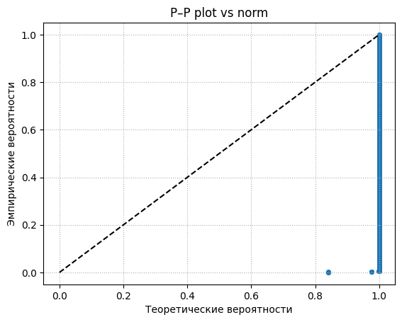
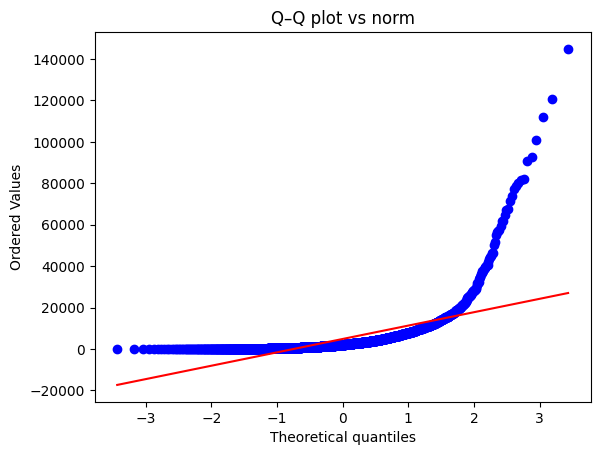

# I Задание на определение выбросов

## 1. Подготовка данных  
- Удалить строки с нулевыми значениями амортизации.

---

## 2. Определение выбросов

### a. По интерквартильному размаху (IQR)  
- Формулы:  
Q1 = 1-й квартиль  
Q3 = 3-й квартиль  
IQR = Q3 - Q1  
LF = Q1 - 1.5 * IQR  
UF = Q3 + 1.5 * IQR  

- Все значения, которые меньше LF или больше UF, считаются выбросами.  
- Вывести общее количество выбросов.

### b. По z-score
- Формула:  
  - z = (x – mean) / std  
- Границы: |z| > 3  

### c. По диаграмме «ящик с усами»  
- При построении box‑plot выбросы определяются по тем же LF/UF, что и в пункте (a).  
- Убедиться, что точки‑выбросы на графике совпадают с рассчитанными по IQR.

### d. По Q–Q plot и P–P plot  
- Построить графики Q–Q и P–P для визуальной оценки отклонений от нормальности.  
- Выделить точки, заметно отходящие от линейного тренда.

---

### 3. Классификация выбросов

**Экстремальные (жёсткие) выбросы**  
- Критерий: |x – mean| > 3.5 * IQR  
- Рекомендуется удалить из выборки.

**Умеренные (мягкие) выбросы**  
- Критерий: 2.0 * IQR <= |x – mean| <= 3.5 * IQR  
- Допускается оставить в наборе данных.  

---

## 4. Вывод

- Сравнить количество выбросов, выявленных методами z‑score и box‑plot (указать % от общего числа наблюдений).  
- Определить долю экстремальных и долю умеренных выбросов.  
- Найти закономерности (по регионам, видам деятельности, типам хозяйств).

---

## 5. Рекомендации по дальнейшей работе с выбросами

| Вариант | Описание | Что считать |  
|---------|----------|-------------|  
| A       | Удалить экстремальные выбросы | среднее, мода, медиана без экстремальных выбросов |  
| B       | Удалить все умеренные выбросы | среднее, мода, медиана без умеренных выбросов |  
| C       | Удалить и экстремальные, и умеренные выбросы | среднее, мода, медиана без всех выбросов |  

- Для каждого варианта рассчитать:  
- Среднее значение  
- Моду  
- Медиану  
- Сравнить, какая из трёх величин более устойчива к выбросам.

---

## 6. Дополнительные шаги

- Объединить выбросы в отдельный кластер (по региону или виду деятельности).  
- При необходимости перейти к ранговым критериям анализа.

---

# II Результаты и выводы

## Результаты анализа выбросов

### a) Выбросы по интерквартильному размаху (IQR)

**Показатель**           | **Значение**
-------------------------|------------
Q1                       | 663.00  
Q3                       | 5133.00  
IQR                      | 4470.00  
Нижняя граница           | -6042.00  
Верхняя граница          | 11838.00  

**Общее число выбросов:** 198  

**Топ-3 регионов по доле выбросов IQR:**

| Субъект РФ               | % от всех выбросов |
|--------------------------|--------------------|
| Воронежская область      | 12.17              |
| Краснодарский край       | 12.17              |
| Московская область       | 10.58              |

---

### b) Выбросы по Z-score

**Число выбросов:** 43  

**Топ-3 регионов по доле выбросов Z-score:**

| Субъект РФ               | % от всех выбросов |
|--------------------------|--------------------|
| Тульская область         | 12.20              |
| Краснодарский край       | 12.20              |
| Белгородская область     |  9.76              |

---

### c) Выбросы по диаграмме «ящик с усами» (coef = 1.5)

Параметры IQR и границы совпадают с пунктом (a):

**Показатель**           | **Значение**
-------------------------|------------
Q1                       | 663.00  
Q3                       | 5133.00  
IQR                      | 4470.00  
Нижняя граница           | -6042.00  
Верхняя граница          | 11838.00  

**Общее число выбросов:** 198  

**Топ-3 регионов по доле выбросов Boxplot:**

| Субъект РФ               | % от всех выбросов |
|--------------------------|--------------------|
| Воронежская область      | 12.17              |
| Краснодарский край       | 12.17              |
| Московская область       | 10.58              |

---

### d) Q–Q plot и P–P plot

---

### Экстремальные (жёсткие) и умеренные (мягкие) выбросы

- **Умеренных выбросов:** 75  
- **Экстремальных выбросов:** 83  

**Топ-3 регионов по умеренным выбросам:**

| Субъект РФ               | % от всех умеренных |
|--------------------------|---------------------|
| Московская область       | 17.33               |
| Краснодарский край       | 17.33               |
| Воронежская область      | 12.00               |

**Топ-3 регионов по экстремальным выбросам:**

| Субъект РФ               | % от всех экстремальных |
|--------------------------|-------------------------|
| Белгородская область     | 12.50                   |
| Воронежская область      | 11.25                   |
| Брянская область         |  8.75                   |

---

## 7. Структурные показатели до и после удаления выбросов

| Вариант                                 | Среднее  | Мода | Медиана |
|-----------------------------------------|---------:|-----:|--------:|
| Исходные данные                         | 4827.42  |  108 |  2063.0 |
| Вариант A (без экстремальных выбросов)  | 3369.49  |  108 |  1915.0 |
| Вариант B (без умеренных выбросов)      | 4439.86  |  108 |  1938.0 |
| Вариант C (без всех выбросов)           | 2916.54  |  108 |  1819.5 |

---

## Вывод по анализу выбросов

- **Много выбросов:**  
  По Z-score найдено **43 выброса** (метод чувствителен к экстремальным значениям), по IQR и boxplot — **198 выбросов** (эти методы более устойчивы к выбросам). Разница связана с тем, что Z-score использует среднее и стандартное отклонение, а IQR и boxplot — квантили.

- **Соотношение жёстких и умеренных выбросов:**  
  Экстремальные (жёсткие) выбросы составляют около **53%**, умеренные — около **47%** всех выбросов. Это указывает на высокую неоднородность данных.

- **Региональные закономерности:**  
  Среди лидеров по доле выбросов постоянно встречаются **Воронежская область**, **Краснодарский край**, **Московская область** и **Белгородская область**. Вероятно, это связано с региональными особенностями или спецификой крупных предприятий.

- **Анализ по Q–Q и P–P графикам:**  
  Q–Q и P–P графики показывают значительный правый «хвост» и сильное отличие от нормального распределения, что подтверждает наличие большого количества высоких значений амортизации.

---

**Итого:**  
В данных по амортизации выявлено большое количество выбросов, и основная их часть обусловлена специфическими региональными и отраслевыми факторами. Эти особенности нужно обязательно учитывать при дальнейшей статистической обработке и анализе.

## Итоговые выводы и рекомендации по работе с выбросами

**1. Устойчивость показателей:**

- **Среднее** сильно зависит от выбросов (снижается почти в 2 раза при удалении всех выбросов).
- **Мода** полностью устойчива, но слишком мала (108), не особо информативна.
- **Медиана** показывает умеренную стабильность (меняется незначительно), является оптимальным структурным показателем для анализа.

**2. Рекомендуемые подходы:**

- Если важна максимальная точность и устранение искажений, целесообразно **удалить все выбросы** (вариант C).
- Если приоритет сохранить данные без радикальных изменений — использовать **медиану** как основной показатель.
- Выбросы стоит дополнительно изучить отдельно (например, выделить в кластер по региону), так как явно видна региональная специфика (лидеры — Воронежская область, Краснодарский край, Московская область и Белгородская область).

**3. Дальнейшая работа:**

- Поскольку данные далеки от нормальных, для дальнейших исследований рекомендую использовать **непараметрические и ранговые методы**, чтобы избежать некорректных выводов.
